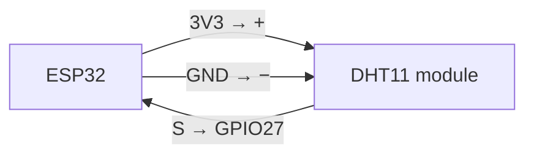
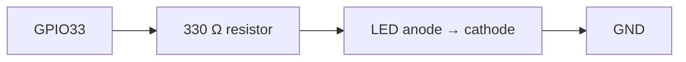
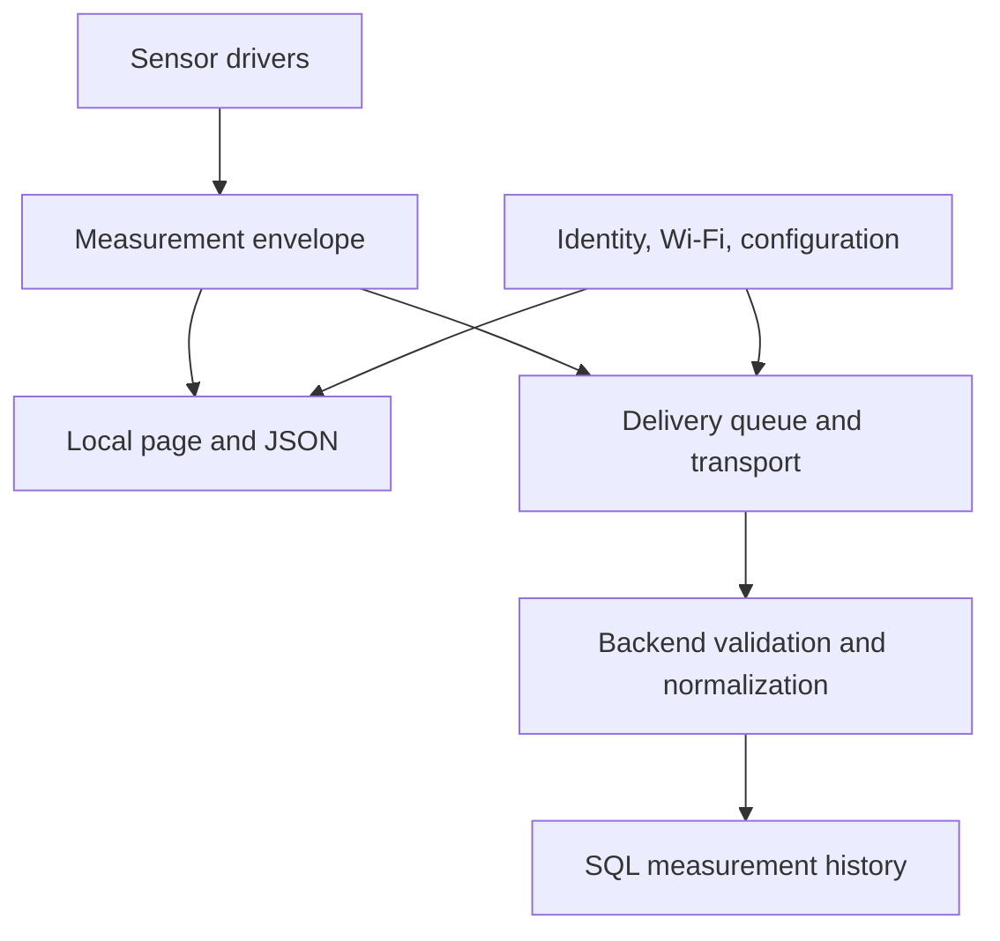

# ESP32 workshop: from a sensor reading to a shared monitoring system

Progress notes — October 5, 2026

We are building a small ESP32 sensor node that can read its surroundings, provide a local web interface, and introduce itself to the ReVillage backend. Temperature and humidity are the first working measurements. The larger aim is to reuse the same setup, identity, networking, and data infrastructure for other sensors, including the river monitor.

## Where we are

| Area | Current evidence | Status |
|---|---|---|
| External LED | Blinking on GPIO33 was confirmed | Bench tested |
| Temperature and humidity | DHT11 readings reported: 23.4 °C / 74.1 °F and 77.0% humidity | Bench tested; example, not calibration |
| Wi-Fi | A connection and local IP were reported | Bench tested |
| Local setup and sensor website | Combined sketch contains setup form, saved credentials, sensor page, and `/sensor` JSON | Implemented in saved sketch; not every route reverified for these notes |
| Backend discovery | Prior testing reported `POST /api/iot`, JSON saved, and HTTP `201` | Successful proof of concept |
| Durable measurement history | SQL storage and a validated JSON format discussed | Proposed |
| Shared firmware modules | Separate sensor reading from setup, web, registration, and transport | Proposed refactor |
| Additional sensors | Sound module identified; optical board being reverse engineered | Not yet integrated |

These notes review the saved `ReVillageSensor.ino` dated October 4, plus reported bench results. The saved file has empty token and certificate placeholders and defaults to LED GPIO2. A configured sketch used during successful testing may differ. No firmware compilation or hardware test was performed while preparing these notes.

## Wiring: working temperature and humidity node

The current sensor is a three-pin **DHT11 module**. Follow its printed labels rather than assuming that another module has the same physical pin order.

| DHT11 module | ESP32 |
|---|---|
| `S` — signal | GPIO27 |
| `+` — middle power pin on our module | 3V3 |
| `−` — ground | GND |



For the external heartbeat LED, use a series resistor. The following is a suggested bench circuit; the exact resistor used in the earlier blink test was not recorded.



The saved sketch selects the LED and DHT pins here:

```cpp
#define LED_PIN 2   // Change to 33 for the tested external LED.
#define DHT_PIN 27
DHT dht(DHT_PIN, DHT11);
```

GPIO34 cannot drive an LED on the classic ESP32: GPIO34–39 are input-only and have no internal software-enabled pull-up or pull-down. GPIO33 can be an output. These pin notes are for the classic ESP32, not automatically for every ESP32-family board. See [Espressif GPIO documentation](https://documentation.espressif.com/projects/esp-idf/en/latest/esp32/api-reference/peripherals/gpio.html).

## Additional sensor experiments

### Microphone sound module

The red board appears to be a KY-038-style sound sensor with a microphone, LM393 comparator, threshold adjustment, and two outputs.

| Board label | Meaning | Suggested ESP32 connection for a future test |
|---|---|---|
| `+` | Power | 3V3 |
| `G` | Ground | GND |
| `AO` | Analog microphone signal | GPIO34 |
| `DO` | Threshold output | Available digital input, for example GPIO32 |

This is a proposed connection, not a tested addition to the current firmware. Powering the module at 3.3 V keeps its supply within the ESP32 logic domain; verify the particular board's outputs before connection. An analog input still needs correct ADC configuration and voltage limits. GPIO34 is an ADC1 input on the classic ESP32; ADC1 is preferable to ADC2 for analog experiments while Wi-Fi is active.

The screw adjusts the digital detection threshold. This module is useful for detecting sound events and exploring relative activity. It does not directly provide calibrated decibel measurements. See [Joy-IT KY-038 documentation](https://sensorkit.joy-it.net/en/sensors/ky-038).

### Salvaged HP optical interrupter board

The green board is marked **HP F0V86-80009, revision A**, with three sensor positions, Q1–Q3. Each sensor has opposing towers and a slot: blocking the optical beam changes the receiver response. This could support position detection or counting passing tabs.

The following numbers are our temporary bench labels for one sensor's solder joints, not manufacturer pin numbers. The recorded description was 1 top right, 2 top left, 3 bottom left, 4 bottom right; a later observation identified 2/4 as the clear side. Those descriptions need reconciliation with an annotated photograph before converting this into a physical wiring diagram.

| Measurement | Observation |
|---|---|
| Continuity 1 ↔ 4 | Tone and about 0.2 in both directions; consistent with a shared trace if the unit is Ω |
| Diode mode, red 2 / black 1 | Approximately 1.060 V |
| Diode mode 1 → 2 | No conduction reported |
| Diode mode 1 ↔ 3 and 2 ↔ 3 | No conduction reported |
| Window appearance | Clear and dark sides observed |

Working electrical hypothesis: pin 2 is an infrared LED anode, the 1/4 node is its cathode/common connection, and pin 3 is a receiver signal. The measurements are in-circuit, so board connections influence them. A receiver's lack of diode-mode conduction does not establish that it is faulty.

Next: verify 2 → 4 directly, reconcile the physical numbering, trace pin 2 to R2, measure resistor values, and map the J1 connector. The arrow-like PCB mark is a useful orientation reference but is not established as a polarity symbol. Clear/dark windows and resistor location are clues; a resistor must be traced in series before calling it an LED current limiter.

**No verified connector pinout or supply arrangement is available yet.** Once established, the nLab scope can observe a receiver voltage while cardboard blocks and clears the slot. A bare LED needs current limiting; a bare phototransistor may need a pull-up. Exact nLab connections remain dependent on its model and input limits.

## Software code review

### What the saved sketch does

The firmware uses WiFi, WebServer, Preferences, Adafruit DHT, ArduinoJson 7, HTTPClient, NetworkClientSecure, and FreeRTOS queues/tasks.

At startup it creates a hardware-derived device ID, initializes the LED and DHT11, loads saved Wi-Fi settings, and tries to connect for up to 15 seconds. If connection fails, it starts the open `Sensor-Setup` access point. The setup form saves SSID, password, and device name in the `wifi` Preferences namespace, then restarts.

In normal mode, the local HTTP server exposes:

| Route | Behavior |
|---|---|
| `GET /` | Temperature, humidity, local IP, firmware version, and latest discovery status |
| `GET /sensor` | Current readings as JSON, including `reading_valid` |

Setup mode instead exposes `GET /` for the form and `POST /save` to store settings.

The main loop is deliberately readable:

```cpp
void loop() {
  server.handleClient();
  updateHeartbeat();
  updateSensor();
  if (!setupMode) updateDiscovery();
  delay(1);
}
```

Sensor readings are attempted every two seconds. Failed reads set `reading_valid` false, and `/sensor` returns null measurement values. The LED pulses for 250 milliseconds on a roughly two-second cycle. Outbound HTTPS runs in a separate worker task, exchanging jobs and results through queues rather than accessing the DHT or web server directly.

### Discovery contract

The worker sends JSON to `https://revillagesociety.org/api/iot` with a bearer token and verified root CA. The payload describes device ID, name, local IP, port 80, firmware name/version, and temperature/humidity capabilities. It does **not** upload the temperature and humidity readings.

A successful 2xx response schedules the next announcement in five minutes; failure schedules a retry in 30 seconds. Reconnection or an IP change makes discovery eligible sooner. The saved sketch disables registration until both `DEVICE_TOKEN` and `ROOT_CA` are set, and waits for an approximately valid system clock before attempting certificate verification.

The earlier `502` was an HTTP gateway error, not proof of a token mismatch. Negative client results represent connection/TLS failures; positive HTTP status codes represent an HTTP response. Later reported backend testing returned `201`. Diagnose using both client output and backend logs.

### Strengths and gaps

| Finding | Why it matters / next change |
|---|---|
| HTTPS worker is separated from web and DHT access | Keeps slow network operations out of the main loop |
| Stable identity and explicit firmware version | Enables device inventory across reboots and network changes |
| JSON validity flag and null failed readings | Avoids presenting a failed reading as a valid measurement |
| Sensor sample has no timestamp or age | Add sample time and age so consumers can judge freshness |
| Discovery and measurements are distinct | Implement an explicit measurement transport and storage contract |
| Startup connection and save/restart use blocking waits | Acceptable for this bench stage; consider a state machine as the device grows |
| Setup fallback occurs at startup | Loss of Wi-Fi during normal operation does not transition into the setup portal |
| Setup AP is open and local HTTP is unauthenticated | Add controlled provisioning access before unattended deployment |
| Token and CA are firmware configuration | Keep secrets out of public code, logs, and workshop examples; support per-device token rotation |
| Retries use fixed intervals | Add capped backoff and jitter when multiple devices are deployed |
| No measurement queue or delivery acknowledgement | Decide what happens to readings during outages before claiming historical completeness |

The latest combined sketch has been read for this review, but has not been compiled here. Successful earlier experiments do not verify every path in this exact saved version.

## Systems design: reusable infrastructure, replaceable sensors

The proposed boundary is simple: a sensor driver knows how to measure; shared infrastructure knows how to configure, identify, present, and deliver those measurements.



Suggested modules for the next refactor:

| Module | Responsibility |
|---|---|
| Device configuration | Identity, name, credentials, firmware metadata |
| Wi-Fi provisioning | Setup access point, persistence, connection state |
| Local web interface | Setup routes, status page, JSON serialization |
| Discovery client | Device announcements, authentication, retries |
| Sensor drivers | DHT11 now; sound, optical events, or river measurements later |
| Measurement transport | Queueing, upload, acknowledgement, outage handling |

This is not yet a completed multi-file framework. First extract the working behavior into modules without changing the external contract; then add a second sensor to test whether the boundaries are useful. Reuse for the river monitor depends on its hardware and communication transport, not just matching function names.

### SQL and JSON storage proposal

A straightforward SQL table is enough for the first history service. Proposed core fields:

| Field | Purpose |
|---|---|
| `id` | Server record UUID |
| `device_id` | Node that submitted the measurement |
| `sensor_id` | Particular sensor on that node |
| `observed_at` | Measurement time; nullable if the device clock is unavailable |
| `received_at` | Backend receipt time |
| `value_type` | Such as `temperature_humidity` or `beam_state` |
| `schema_version` | Version of the normalized payload |
| `payload` | Validated JSON; JSONB if using PostgreSQL |

Separate observation and receipt times preserve the meaning of delayed uploads. Device identity and sensor identity should also be distinct: one ESP32 may host several sensors.

Illustrative normalized message — **proposed, not the current API contract**:

```json
{
  "schema_version": 1,
  "measurement_id": "device-generated-unique-id",
  "device_id": "esp32-example",
  "sensor_id": "dht11-1",
  "observed_at": "2026-10-05T17:00:00Z",
  "value_type": "temperature_humidity",
  "values": {
    "temperature_c": 23.4,
    "humidity_percent": 77.0
  },
  "quality": {"valid": true}
}
```

The backend interface can translate sensor-specific JSON into this common format. Validate incoming shape, allowed sensor types, units, numeric values, ownership, and payload size, then validate the normalized result before storage. Define required fields and schema versions explicitly. Preserve raw input separately only when it serves a debugging or migration need.

A client measurement ID can support idempotent retries: receiving the same measurement twice should not produce two history records. Store Celsius as the canonical temperature and derive Fahrenheit for display. Authentication should bind the reported device to its permitted tenant; do not trust a JSON device ID alone.

### Discovery is not remote reachability

Advertising a private LAN IP to the public backend creates an inventory entry. It does not make that address reachable from the internet. Outbound measurement uploads are a natural next step for this setup. If remote polling is wanted later, it needs an explicit network path such as a local gateway or VPN.

## Development tools and next workshop

VS Code can be the editor while Arduino CLI handles builds and uploads. The CLI workflow is proposed; it has not yet been established as a tested project toolchain.

Keep the sketch in `ReVillageSensor/ReVillageSensor.ino`, select the actual board's fully qualified board name, and discover the serial port:

```bash
arduino-cli board list
arduino-cli compile --fqbn "$ESP32_FQBN" ./ReVillageSensor
arduino-cli upload --port "$ESP32_PORT" --fqbn "$ESP32_FQBN" ./ReVillageSensor
arduino-cli monitor --port "$ESP32_PORT" --config baudrate=115200
```

`ESP32_FQBN` and `ESP32_PORT` must be set to the selected board and port. Install the ESP32 core and the DHT/Unified Sensor/ArduinoJson dependencies first. Pin their versions when establishing a reproducible workshop build. Upload does not itself compile the sketch. See [Arduino CLI getting started](https://docs.arduino.cc/arduino-cli/getting-started/) and [upload reference](https://docs.arduino.cc/arduino-cli/commands-reference/arduino-cli_upload).

The next workshop can focus on:

1. Compile and run the exact saved sketch with documented board/core/library versions and LED GPIO33 if using the external circuit.
2. Verify setup, credential persistence, local JSON, sensor failure behavior, reconnect, and authenticated discovery.
3. Add sample time and age, then agree on the normalized measurement schema and backend ingestion contract.
4. Extract shared infrastructure and integrate one additional sensor.
5. Finish optical-board mapping before attempting a powered nLab or ESP32 test.

The milestone we have reached is a working proof of concept for sensing, local access, and backend discovery. The next milestone is reliable, validated measurement history shared across more than one sensor type.
